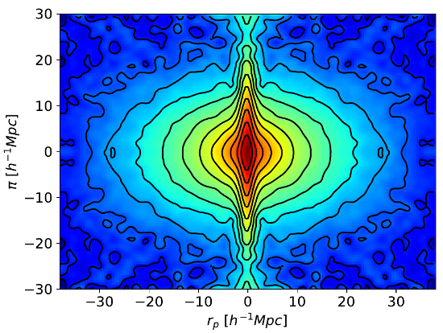

# Gundam 

A package to count galaxy pairs at light speed and estimate 2-point correlation functions 
of large galaxy samples or mock catalogs, that works with angular, projected and
redshift-space coordinates. Its main features are:

* **Speed**  
By calling Fortran routines that implement efficient skip-list/linked-list algorithms,
it can be extremely fast  
* **Parallel**  
Employs the OpenMP framework to make use of multi-core CPUs  
* **User-defined Weights and Error Estimates**  
Accepts weighted pair counts defined by the user and can also estimate statistical
boostrap errors with minimal overhead  
* **User-friendly and Flexible**  
By carefully wrapping Fortran code in a suitable Python framework, it is very easy to use and extend its functionality by both novice and seasoned users  
* **Bonus Track**  
Lots of auxiliary and plotting functions to produce nice, paper-ready plots for 
1D/2D correlations, complete with ratios, labels and even power-law fits  

## Getting Started
Input data consists of astropy tables (see [Astropy Tables](http://docs.astropy.org/en/stable/table/)), 
which provides an excellent I/O framework for a variety of formats (ASCII, VOTable, FITS tables, etc.)

Gundam also employs special dictionaries (see [Munch](https://pypi.python.org/pypi/munch))
to pack multiple parameters or output fields at once. Such dictionaries have
attribute-like access with dot notation. If you are used to ipython's dot+tab 
completion you will love this.

A typical usage workflow consists of:
1. Read data into astropy tables, usually one table for the "data" sample and 
another one for the "random" sample.
2. Create and customize a dictionary for input parameters (e.g. to set binning, 
cosmology, estimator, etc.)
3. Calculate the statistic (correlation function or simply the pair counts for a 
given geometry)

```
import gundam as gun
from astropy.table import Table

gals = Table.read('red_gals.fits')   # Read data
rans = Table.read('red_rans.fits')   # Read randoms
gals['wei'] = 1.                     # If there are no weights, just fill with 1's
rans['wei'] = 1.                     # If there are no weights, just fill with 1's

par = gun.packpars(kind='pcf')       # Get defaults for a proj. corr. function (pcf)
par.h0      = 69.5                   # Change H0
par.nsepp   = 24                     # Set 24 bins in projected separation
par.dsepp   = 0.1                    # Each of size 0.1 dex
par.estimator = 'LS'                 # Pick Landy-Szalay estimator 

c = gun.pcf(gals, rans, par, nthreads=4)   # Estimate pcf using 4 threads

c.qprint()                           # Quickly check the output fields (dd, rr, etc.)
gun.cnttable(c)                      # Or show counts in your browser
gun.cntplot(c)                       # Or plot the pcf
```

For further information please read-the-docs [here](https://readthedocs.org/projects/gundam/).
There is a very decent introduction so you can start using Gundam within 5 minutes,
and of course the full API.
    
## Example Runs
Data and code for 3 examples demonstrating typical use cases are provided in the 
repo (*example_lrg.py*, *example_pcf.py* and *example_redblue.py*). For the moment 
these are couple plots to illustrate what can be done with Gundam in just a few 
lines of code  


    
### Prerequisites

You will need to have these:

* [Python 3.5 or later](http://www.python.org/)
* [GCC Compiler (C, Fortran & OpenMP support)](https://gcc.gnu.org/)
* [munch](https://pypi.python.org/pypi/munch)
* [pymorton](https://github.com/trevorprater/pymorton/) (optional, only needed
if experimenting with different orderings)


### Installing

To install Gundam, you have two choices: (1) build from scratch, or (2) use pip. 
I recommend method (1), since it will allow easy access to modify or extend the 
Fortran counting routines. In any case, make sure to fulfil the required 
dependencies. Option 2 using pip is not yet functional.

You just need to clone the Gundam repository and type make

```
git clone https://github.com/el_samotracio/gundam.git
cd gundam
make
```

By default this will compile and build the library in-place. Feel free to modify 
the Makefile to suit your needs. After compilation, you can optionally install 
the library in your default global-site packages directory

```
python setup.py install
```

or in your default user packages directory

```
python setup.py install --user
```

## Contributing

Please read [CONTRIBUTING](CONTRIBUTING.md) for details on our code of conduct, and the process for submitting pull requests to us.

## Authors

* **Emilio Donoso** - ICATE-CONICET [(contact)](mailto:edonoso@conicet.gov.ar)

## License

This project is licensed under the MIT License - see the [LICENSE](LICENSE.md) file for details


